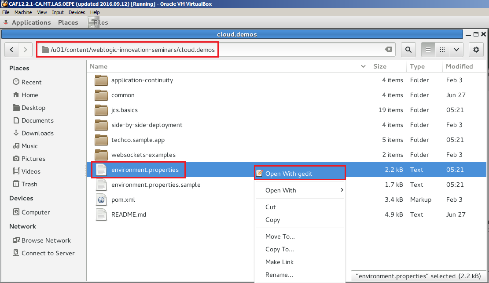
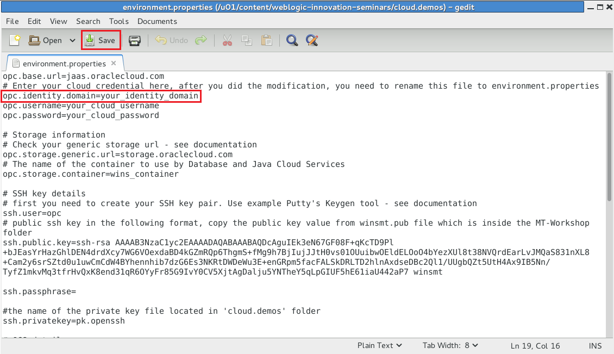

# Oracle OpenWorld 2016 #

# #7605 - Hands On Tutorial #

### Introduction

Oracle Cloud is the industry’s broadest and most integrated public cloud. It offers best-in-class services across software as a service (SaaS), platform as a service (PaaS), and infrastructure as a service (IaaS), and even lets you put Oracle Cloud in your own data center. Oracle Cloud helps organizations drive innovation and business transformation by increasing business agility, lowering costs, and reducing IT complexity.

----

### Prerequisites ###

Get the following details ready to complete the tutorial:

+ Oracle Cloud **identity domain** - Instructor provides the details
+ Oracle Cloud account **username** and **password** - you can find the credential's value in the property file (see below).

#### Prepare your desktop to access the assigned cloud enviroment ###
In order to access and use the proper cloud account/environment you need to modify the following property file: `/u01/content/weblogic-innovation-seminars/cloud.demos/environment.properties`. Open the file browser and find the file to edit using `gedit`.

Replace the identity domain property's value which is allocated by the instructor.

Click Save and note the `opc.username` and `opc.password` properties. This user name and password belong to the Oracle Public Cloud Services assigned to you. You can leave the editor open for later usage of login details.

----

###SpringBoot sample application development lifecycle using Oracle Developer Cloud Service, Application Container Cloud Service and Oracle Enterprise Pack For Eclipse###

1. [Create Oracle Developer Cloud Service project for SpringBoot demo application.](https://github.com/oracle-weblogic/weblogic-innovation-seminars/blob/caf-12.2.1/cloud.demos/jcs.basics/create.devcs.project.springboot.md)
2. [Create continuous build integration using Oracle Developer Cloud Service and Oracle Application Container Cloud Service.](https://github.com/oracle-weblogic/weblogic-innovation-seminars/blob/caf-12.2.1/cloud.demos/jcs.basics/devcs.accs.ci.md)
3. [Using Eclipse IDE (Oracle Enterprise Pack for Eclipse) with Oracle Developer Cloud Service.](https://github.com/oracle-weblogic/weblogic-innovation-seminars/blob/caf-12.2.1/cloud.demos/jcs.basics/setup.oepe.md)
4. [Deploy TechCo Demo application to Oracle Java Cloud Service. This application will provide REST interface for SpringBoot sample application.](https://github.com/oracle-weblogic/weblogic-innovation-seminars/blob/caf-12.2.1/cloud.demos/HOL7605/deployTechCoApp.md)
5. [Implement new function (REST client) in SpringBoot sample application using Service Bindings to access Oracle Java Cloud Services.](https://github.com/oracle-weblogic/weblogic-innovation-seminars/blob/caf-12.2.1/cloud.demos/jcs.basics/change.mgmt.devcs.md)

####Clean up the environment####

+ Reset the environment