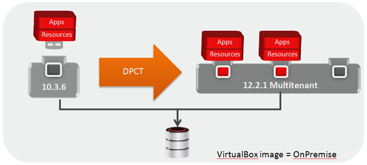

# ORACLE Public Cloud Services tutorial #
-----
## Convert WebLogic 11g domain into the 12cR2 partition through DPCT tool ##

### About this tutorial ###

This part of the tutorial showe how to convert existing Weblogic Server 11g domain into the importable format of WebLogic Server 12cR2 Domain Partition and import that pertition into WebLogic Server 12cR2 domain

Inside VirtualBox VM we have already created Domain1036 in /u01/wins/wls1036/user_projects/domains/Domain1036. This domain contains Admin Server only, we created PetstoreDB as Datasource and Deployed JSF-2.0.war as shared library and deployed petstore.12.war as an application to the Admin Server. This is the **source domain**, which we are going to convert to the image of the WebLogic Domain Partition through DPCT tool. This process will create a Domain1036.zip and Domain1036-attributes.json file.

We have also created Domain1221 in /u01/wins/wls1221/user_projects/domains/Domain1221. This is empty domain, which contains Admin Server only. This will be our **target domain**, where we will import the previous domain Domain1036 as partition. 

### Prerequisites ###

- Configured WebLogic Server 11g domain with sample application
- Configured WebLogic Server 12cR2 domain
- Running Oracle Database with application data needed for sample application

### Steps ###

#### Starting the Admin Server in both domains ####

