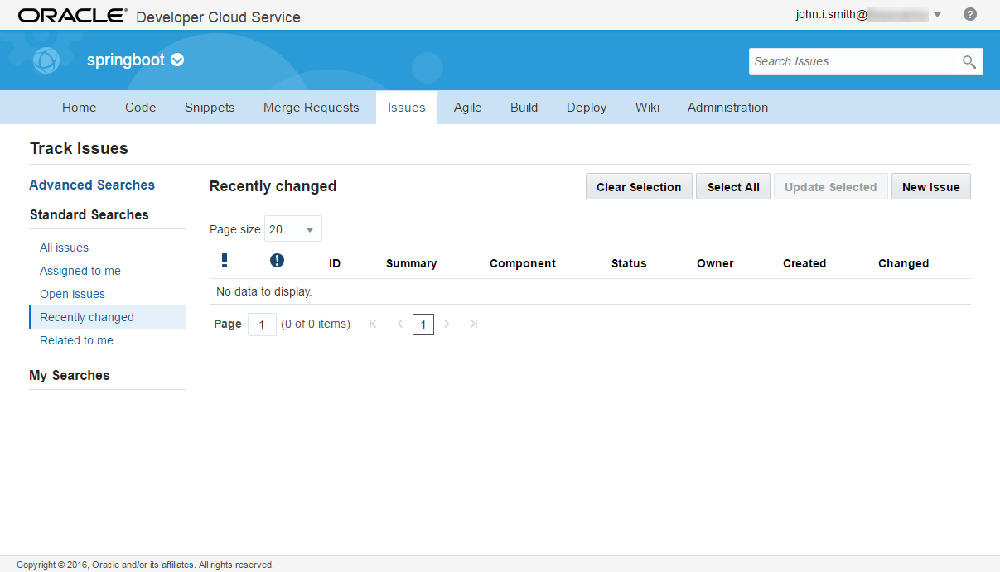
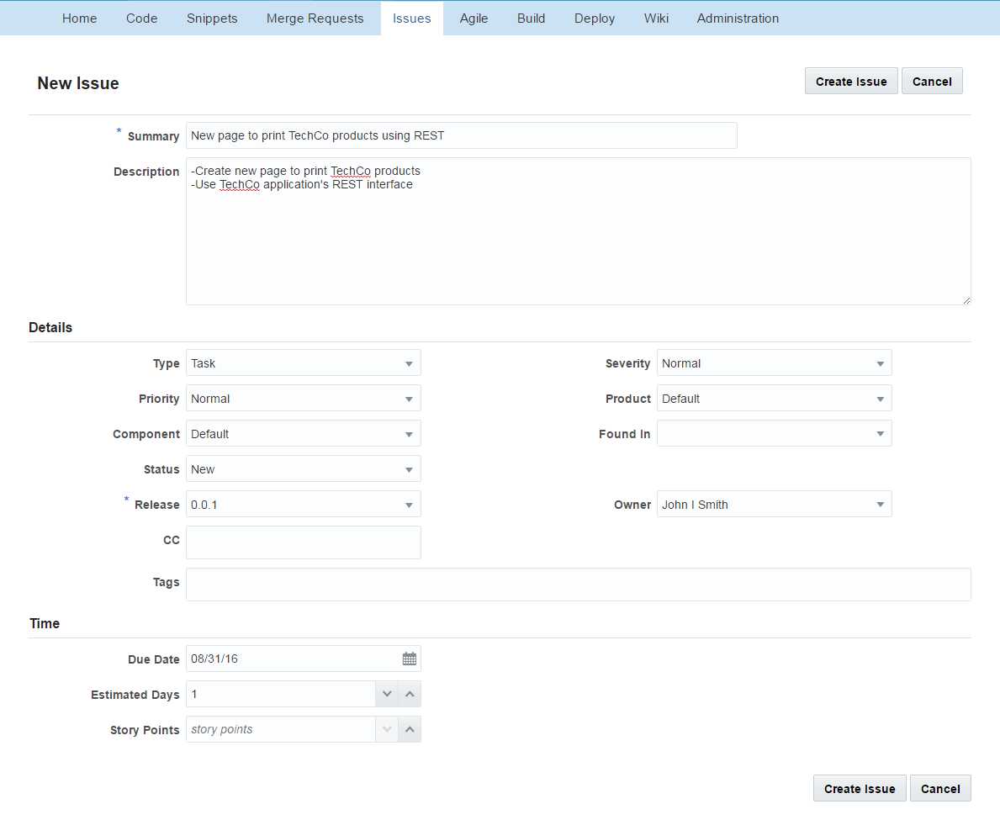

# ORACLE Public Cloud Services tutorial #
-----
## Using Eclipse IDE (Oracle Enterprise Pack for Eclipse) with Oracle Developer Cloud Service ##

### Introduction ###
This tutorial based on standardized developer workflow using Oracle Developer Cloud Service. The intent is to showcase how a team starting on the Oracle Developer Cloud Service would collaborate to address change management use-case.

### About this tutorial ###
This tutorial demonstrates how to:
	
+ Create issue/task using Oracle Developer Cloud Service user interface
+ Open/Close issue/task using OEPE Cloud Tooling
+ Add changes to the source code and push to remote (DevCS hosted) repository
+ How continuous integration can be triggered by source code changes
+ Check Application Cloud Container redeployment using OEPE Cloud Tooling

### Prerequisites ###

+ [Create Oracle Developer Cloud Service project for SpringBoot application](https://github.com/oracle-weblogic/weblogic-innovation-seminars/blob/caf-12.2.1/cloud.demos/jcs.basics/create.devcs.project.springboot.md)
+ [Create continuous build integration using Oracle Developer Cloud Service and Oracle Application Container Cloud Service](https://github.com/oracle-weblogic/weblogic-innovation-seminars/blob/caf-12.2.1/cloud.demos/jcs.basics/devcs.accs.ci.md)
+ [Using Eclipse IDE (Oracle Enterprise Pack for Eclipse) with Oracle Developer Cloud Service](https://github.com/oracle-weblogic/weblogic-innovation-seminars/blob/caf-12.2.1/cloud.demos/jcs.basics/setup.oepe.md)
+ [Deploy JEE sample application to Oracle Java Cloud Service using Admin console](https://github.com/oracle-weblogic/weblogic-innovation-seminars/blob/caf-12.2.1/cloud.demos/jcs.basics/deploy.to.jcs.md)

### Steps ###

#### Create Issue/Task using Oracle Developer Cloud Service user interface ####

[Sign in](https://github.com/oracle-weblogic/weblogic-innovation-seminars/blob/caf-12.2.1/cloud.demos/jcs.basics/sign.in.to.oracle.cloud.md) to [https://cloud.oracle.com](https://cloud.oracle.com). On the dashboard open the Developer Cloud Service Console.

Open the SpringBoot project and click Issues tab. Click New Issue.

Enter properties of the new task. The new task will be to create new page in SpringBoot demo application to show TechCo products using that [application](https://github.com/oracle-weblogic/weblogic-innovation-seminars/blob/caf-12.2.1/cloud.demos/jcs.basics/deploy.to.jcs.md)'s REST interface. You can use values on the picture but the point is only to create new Issue assigned to your account which can be used to simulate task assignement to specific user.

Now switch to OEPE to check your tasks. If your OEPE is already opened and cloud connection is activeted then you can see Eclipse notification about the assignement. To open the task  in OEPE click on notification link or activate your cloud connection and open myOracleCloud(cloud connaction name) -> Developer -> springboot(DevCS project name) -> Issues -> Mine

Double click on the task to open details. Scroll down and ACCEPT the assignement. Click Submit and start the development.

