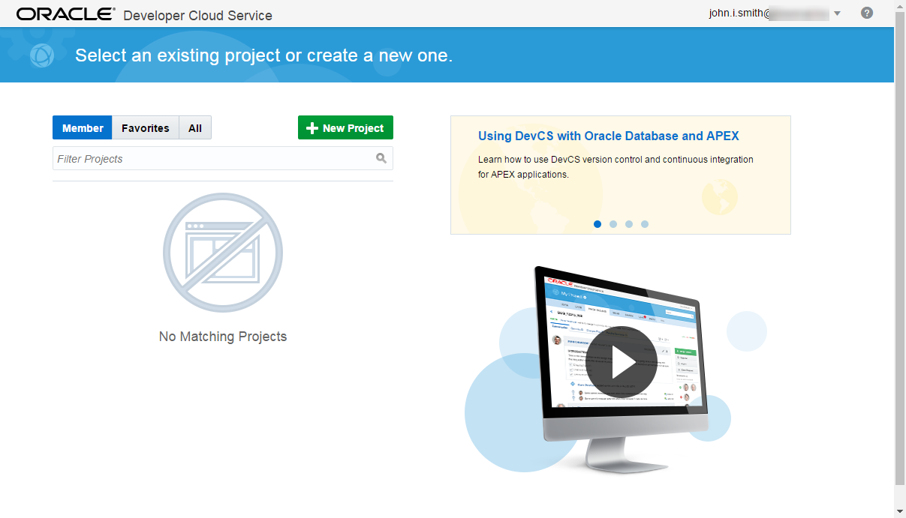
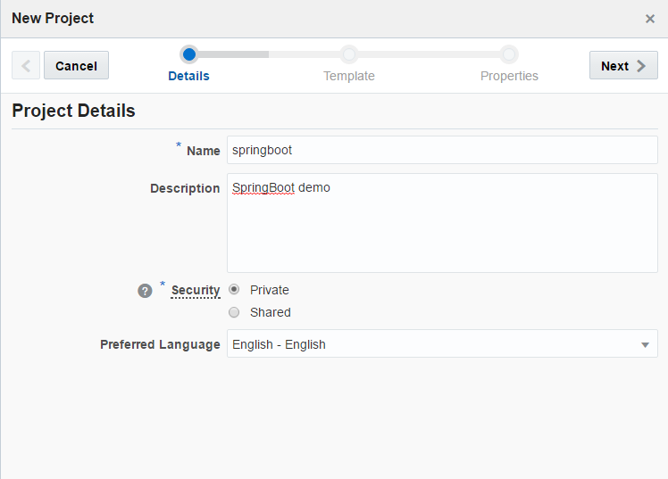
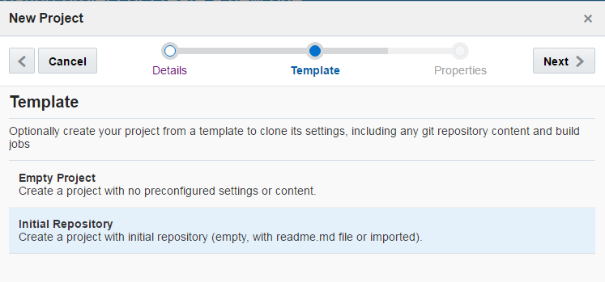
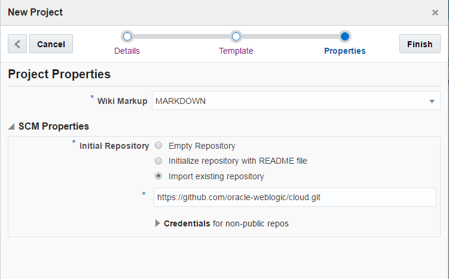
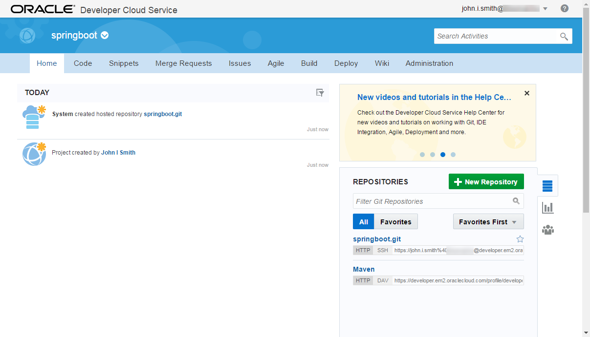

# ORACLE Public Cloud Service tutorial #
-----
## Create Oracle Developer Cloud Service project using initial git repository ##

### Introduction ###
Oracle Developer Cloud Service is a cloud-based software development Platform as a Service (PaaS) and a hosted environment for your application development infrastructure. It provides an open-source standards-based solution to manage the application development life cycle effectively through integration with Hudson, Git, Maven, issues, and wikis. Using Oracle Developer Cloud Service, you can commit your application source code to the Git repository on the Oracle Cloud, track assigned issues and defects online, share information using wiki pages, peer review the source code, and monitor project builds. After successful testing, you can deploy the project to Oracle Java Cloud Service - SaaS Extension, publicly available Oracle Java Cloud Service instances, Oracle Application Container Cloud Service instances, or to an on-premise production environment.

The key features of Oracle Developer Cloud Service include:

Project creation, configuration, and user management

+ Version control and source code management with Git
+ Storage of application dependencies and libraries with Maven
+ Continuous build integration with Hudson
+ Wiki for document collaboration
+ Issue tracking system to track tasks, defects, and features
+ Repository branch merge after code review
+ Deployment to Oracle Java Cloud Service - SaaS Extension, Oracle Java Cloud Service, and Oracle Application Container Cloud Service

Oracle Developer Cloud Service is available as a web interface accessible from a web browser and from Integrated Development Environments (IDEs) such as Oracle Enterprise Pack for Eclipse (OEPE), Oracle JDeveloper, and NetBeans IDE.

### About this tutorial ###
This tutorial demonstrates how to:
	
+ Create Oracle Developer Cloud Service project using existing external Git repository

### Prerequisites ###

- Oracle Public Cloud Service account including Developer Cloud Service

### Steps ###

#### Create Oracle Developer Cloud Service Project ####

[Sign in](https://github.com/oracle-weblogic/weblogic-innovation-seminars/blob/caf-12.2.1/cloud.demos/jcs.basics/sign.in.to.oracle.cloud.md) to [https://cloud.oracle.com](https://cloud.oracle.com). On the dashboard open the Developer Cloud Service Console.

To create an Oracle Developer Cloud Service project in the web user interface From the Welcome page, click New Project.

In the Project Details page of the New Project wizard, complete the elements. Security is about project's privacy level. Private projects are accessible to invited members only. Shared projects are accessible to all members of the organization. Click Next.
 

In the Template page of the New Project wizard select to create the project with an initial repository. You will choose initialization options in the next page of the wizard. Click Next.
 

In the New Repository dialog, in Initial content, select Import existing repository.Enter or copy the [https://github.com/oracle-weblogic/cloud.git](https://github.com/oracle-weblogic/cloud.git) repository address.

After you create a project in Oracle Developer Cloud Service, you are assigned to the Owner role and are automatically navigated to the project's Home page once the provisioning has been completed.

Now the project is ready for using. Typical workflow is to add members, setup roles. Users can start to clone the source code repository, create snippets library, submit issues, create and track project schedule, define build and deploy target for continuous integration, contribute to project's wiki.

For further details about Oracle Developer Cloud Service's features see the [documentation](http://docs.oracle.com/cloud/latest/devcs_common/CSDCS/GUID-2C1FA9B6-C13A-4A80-AC34-72F9F5EEB7BF.htm#CSDCS3118).