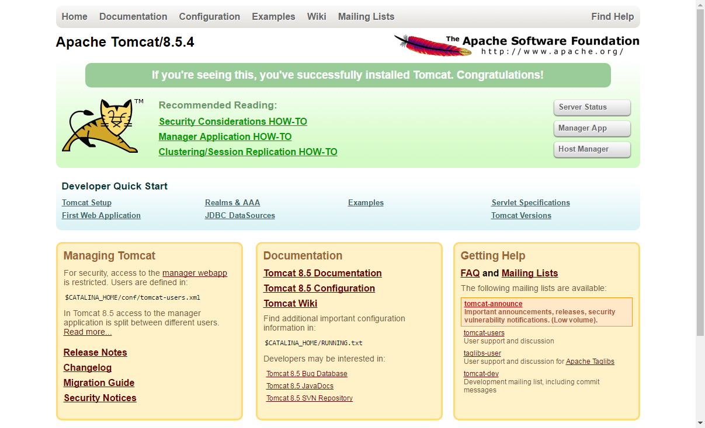
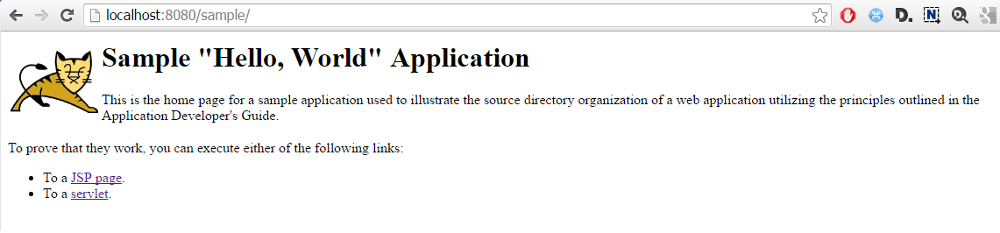
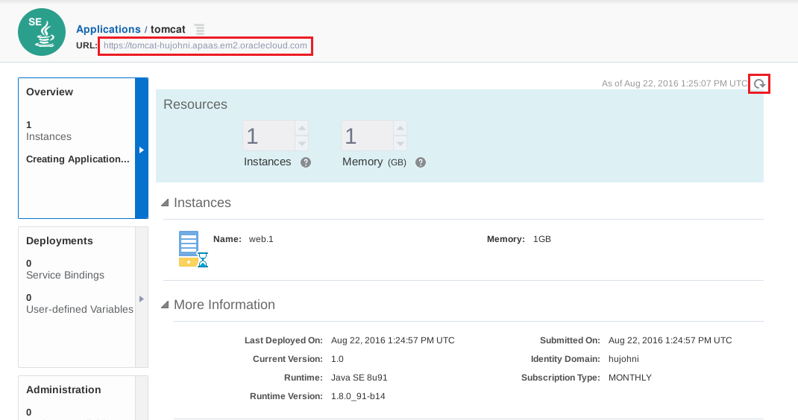
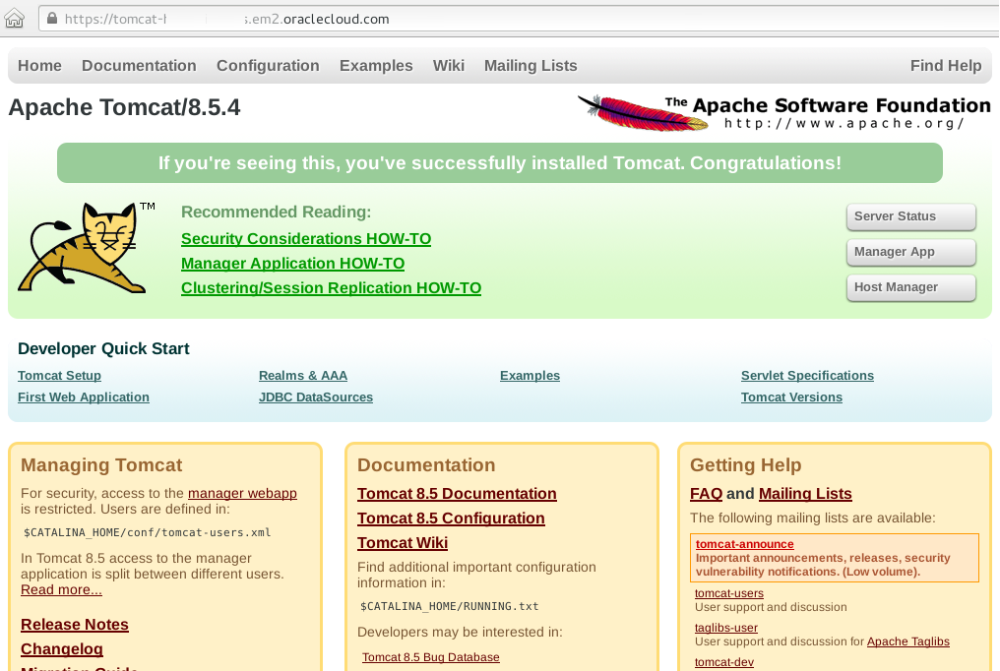
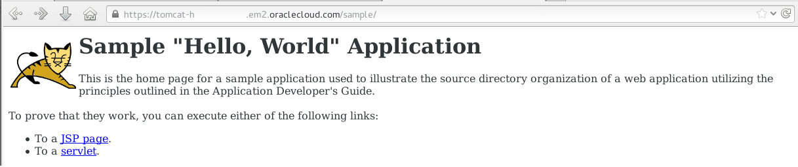

# ORACLE Public Cloud Service tutorial #
-----
## Deploy Tomcat based application to Application Container Cloud Service ##

### About this tutorial ###
Oracle Application Container Cloud Service includes Oracle Java SE Cloud Service and Oracle Node Cloud Service. It provides a lightweight infrastructure so that you can run Java SE 7, Java SE 8, and Node.js applications in the Oracle Cloud.

This tutorial demonstrates how to 

+ package your existing Tomcat (Java SE) based solution to Application Container Cloud Service
+ deploy application to Application Container Cloud Service
	
### Prerequisites ###

- Oracle Cloud Services account including Application Cloud Container Service.

### Steps ###

#### Deploy Tomcat Sample Application on-premise ####

Download Apache Tomcat 8.5.4 into folder `/u01` from [http://apache.belnet.be/tomcat/tomcat-8/v8.5.4/bin/apache-tomcat-8.5.4.tar.gz](http://apache.belnet.be/tomcat/tomcat-8/v8.5.4/bin/apache-tomcat-8.5.4.tar.gz). If the direct link doesn't work please find the right download location of the latest or desired version of Tomcat on [https://tomcat.apache.org/](https://tomcat.apache.org/).

	[oracle@localhost Desktop]$ cd /u01
	[oracle@localhost u01]$ wget http://apache.belnet.be/tomcat/tomcat-8/v8.5.4/bin/apache-tomcat-8.5.4.tar.gz  -P /u01/
	--2016-08-22 02:33:13--  http://apache.belnet.be/tomcat/tomcat-8/v8.5.4/bin/apache-tomcat-8.5.4.tar.gz
	Resolving www-proxy.us.oracle.com (www-proxy.us.oracle.com)... 148.87.19.20
	Connecting to www-proxy.us.oracle.com (www-proxy.us.oracle.com)|148.87.19.20|:80... connected.
	Proxy request sent, awaiting response... 200 OK
	Length: 9271609 (9.4M) [application/x-zip]
	Saving to: ‘/u01/apache-tomcat-8.5.4.tar.gz’
	
	100%[==============================================================================================================>] 9,271,609    283KB/s   in 41s    
	
	2016-08-22 02:43:33 (219 KB/s) - ‘apache-tomcat-8.5.4.tar.gz’ saved [9271609/9271609]
	
	[oracle@localhost u01]$ 

Extraxt the archive into `/u01`.

	[oracle@localhost u01]$ tar -zvxf /u01/apache-tomcat-8.5.4.tar.gz -C /u01
	apache-tomcat-8.5.4/conf/
	apache-tomcat-8.5.4/conf/catalina.policy
	apache-tomcat-8.5.4/conf/catalina.properties
	apache-tomcat-8.5.4/conf/context.xml
	...
	...
	...
	apache-tomcat-8.5.4/bin/setclasspath.sh
	apache-tomcat-8.5.4/bin/shutdown.sh
	apache-tomcat-8.5.4/bin/startup.sh
	apache-tomcat-8.5.4/bin/tool-wrapper.sh
	apache-tomcat-8.5.4/bin/version.sh
	[oracle@localhost u01]$ 

Now start Tomcat server using its `startup.sh` script:

	[oracle@localhost u01]$ apache-tomcat-8.5.4/bin/startup.sh 
	Using CATALINA_BASE:   /u01/apache-tomcat-8.5.4
	Using CATALINA_HOME:   /u01/apache-tomcat-8.5.4
	Using CATALINA_TMPDIR: /u01/apache-tomcat-8.5.4/temp
	Using JRE_HOME:        /usr/java/latest
	Using CLASSPATH:       /u01/apache-tomcat-8.5.4/bin/bootstrap.jar:/u01/apache-tomcat-8.5.4/bin/tomcat-juli.jar
	Tomcat started.
	[oracle@localhost u01]$ 

Open browser to check Tomcat is running. Hit http://localhost:8080/ 

Open a browser and hit the following URL: `http://localhost:8080`
You should now see the home page of Apache Tomcat server.

The sample application is available at [https://tomcat.apache.org/tomcat-8.0-doc/appdev/sample/sample.war](https://tomcat.apache.org/tomcat-8.0-doc/appdev/sample/sample.war). To deploy the application it is simple copy of the application archive (war) to the `TOMCAT_INSTALL_DIRECTORY/webapps` folder. In the terminal use wget to download the archive directly to Tomcat server's webapp directory.

	[oracle@localhost u01]$ wget https://tomcat.apache.org/tomcat-8.0-doc/appdev/sample/sample.war -P /u01/apache-tomcat-8.5.4/webapps
	--2016-08-22 03:32:11--  https://tomcat.apache.org/tomcat-8.0-doc/appdev/sample/sample.war
	Resolving www-proxy.us.oracle.com (www-proxy.us.oracle.com)... 148.87.19.20
	Connecting to www-proxy.us.oracle.com (www-proxy.us.oracle.com)|148.87.19.20|:80... connected.
	Proxy request sent, awaiting response... 200 OK
	Length: 4606 (4.5K)
	Saving to: ‘/u01/apache-tomcat-8.5.4/webapps/sample.war’
	
	100%[==============================================================================================================>] 4,606       --.-K/s   in 0s      
	
	2016-08-22 03:32:13 (60.3 MB/s) - ‘/u01/apache-tomcat-8.5.4/webapps/sample.war’ saved [4606/4606]
	
	[oracle@localhost u01]$

Now check the log file about the successful deployment of sample application.

	[oracle@localhost u01]$ tail apache-tomcat-8.5.4/logs/catalina.out 
	22-Aug-2016 02:47:56.149 INFO [localhost-startStop-1] org.apache.catalina.startup.HostConfig.deployDirectory Deployment of web application directory /u01/apache-tomcat-8.5.4/webapps/host-manager has finished in 29 ms
	22-Aug-2016 02:47:56.149 INFO [localhost-startStop-1] org.apache.catalina.startup.HostConfig.deployDirectory Deploying web application directory /u01/apache-tomcat-8.5.4/webapps/examples
	22-Aug-2016 02:47:56.530 INFO [localhost-startStop-1] org.apache.catalina.startup.HostConfig.deployDirectory Deployment of web application directory /u01/apache-tomcat-8.5.4/webapps/examples has finished in 331 ms
	22-Aug-2016 02:47:56.531 INFO [localhost-startStop-1] org.apache.catalina.startup.HostConfig.deployDirectory Deploying web application directory /u01/apache-tomcat-8.5.4/webapps/docs
	22-Aug-2016 02:47:56.554 INFO [localhost-startStop-1] org.apache.catalina.startup.HostConfig.deployDirectory Deployment of web application directory /u01/apache-tomcat-8.5.4/webapps/docs has finished in 24 ms
	22-Aug-2016 02:47:56.564 INFO [main] org.apache.coyote.AbstractProtocol.start Starting ProtocolHandler [http-nio-8080]
	22-Aug-2016 02:47:56.578 INFO [main] org.apache.coyote.AbstractProtocol.start Starting ProtocolHandler [ajp-nio-8009]
	22-Aug-2016 02:47:56.580 INFO [main] org.apache.catalina.startup.Catalina.start Server startup in 1187 ms
	22-Aug-2016 03:32:17.457 INFO [localhost-startStop-2] org.apache.catalina.startup.HostConfig.deployWAR Deploying web application archive /u01/apache-tomcat-8.5.4/webapps/sample.war
	22-Aug-2016 03:32:17.507 INFO [localhost-startStop-2] org.apache.catalina.startup.HostConfig.deployWAR Deployment of web application archive /u01/apache-tomcat-8.5.4/webapps/sample.war has finished in 49 ms
	[oracle@localhost u01]$ 

You can see in the last two log entries about sample.war deployment. Go back to your browser and enter the sample application's URL: [http://localhost:8080/sample](http://localhost:8080/sample).

Finally stop Tomcat server before preparing it to deploy Application Container Cloud Service.

	[oracle@localhost u01]$ /u01/apache-tomcat-8.5.4/bin/shutdown.sh 
	Using CATALINA_BASE:   /u01/apache-tomcat-8.5.4
	Using CATALINA_HOME:   /u01/apache-tomcat-8.5.4
	Using CATALINA_TMPDIR: /u01/apache-tomcat-8.5.4/temp
	Using JRE_HOME:        /usr/java/latest
	Using CLASSPATH:       /u01/apache-tomcat-8.5.4/bin/bootstrap.jar:/u01/apache-tomcat-8.5.4/bin/tomcat-juli.jar
	[oracle@localhost u01]$ 

#### Packaging Tomcat server and sample application for Application Cloud Container Service deployment ####

Once your application has been tested locally, create an archive (.zip, .tgz, .tar.gz file) that includes the application, any dependent libraries, and the `manifest.json` file. When you upload your application to Oracle Application Container Cloud Service using the user interface, you must include a file called `manifest.json` in the application archive. If you use the REST API to upload the application, this file is still required but doesn’t have to be in the archive.
The other file, `deployment.json`, is optional and is not included in the archive. You can specify the values in this file via the user interface, or you can upload the file using the REST API. In this tutorial shows the deployment using user interface.

Once you have developed your application, you need to decide how to include or reference any dependent libraries. For a Java application, you can do this by creating an uber JAR file or by using the classpath. Remember that the command used to launch your application is up to you.

You can launch directly by invoking `java` or use a shell script. The application is executed in a Linux container, so most of the rules that apply to running a command in Linux apply. In case of our Tomcat sample the application using a shell script. The command line for execution will be something like this:

	sh bin/catalina.sh

To create `manifest.json` use your favorite text editor (e.g. vi, gedit). The tutorial will use vi.

	[oracle@localhost u01]$ vi /u01/apache-tomcat-8.5.4/manifest.json

Press 'i' to edit file. Write or copy the the following content:
	
	{
		"runtime": {
		  "majorVersion": "8"
		},
		"command": "sh bin/catalina.sh run"
	}
	~                                                                                                                                                       
	~                                                                                                                                                       
	~                                                                                                                                                                                                                                                                                               
	~                                                                                                                                                       
	~                                                                                                                                                       
	~                                                                                                                                                       
	~                                                                                                                                                       
	~                                                                                                                                                       
	-- INSERT --

Use **Esc** then **Shift+Q** then write `wq` and hit Enter to save the file. This is the minimum (mandatory) version of metadata file. There are other useful properties for example: startUpTime, release, notes, etc. See [documentation](http://docs.oracle.com/cloud/latest/apaas_gs/DVCJV/GUID-D98FB882-5E58-4318-9DCB-4B404FD86E14.htm#DVCJV-GUID-D98FB882-5E58-4318-9DCB-4B404FD86E14) for further details.

Why we use `catalina.sh`? Tomcat needs to be started as a foreground process which means you cannot use `startup.sh` because that will background Tomcat and the container will exit. Instead you must use directly sh `catalina.sh run` to launch Tomcat in the foreground.

Now package the Tomcat server which is already contains the sample application war file. The package name will be **tomcat.sample.tgz**:

	[oracle@localhost u01]$ cd /u01/apache-tomcat-8.5.4/ && tar -zcvf ../tomcat.sample.tgz * && cd ..
	bin/
	bin/version.sh
	bin/bootstrap.jar
	...
	...
	...
	work/Catalina/localhost/host-manager/
	work/Catalina/localhost/examples/
	work/Catalina/localhost/docs/
	
Check the result using `ls`. You have the **tomcat.sample.tgz** in folder `/u01`:

	[oracle@localhost u01]$ ls
	apache-tomcat-8.5.4  content  oepe-12.2.1.4.201608161938  python            tomcat.sample.tgz
	app                  dpct     psmcli.zip                  Python-3.5.2.tgz  wins
	[oracle@localhost u01]$ 

#### Deploy to Application Cloud Container Service ####
The application now ready to deploy. [Sign in](https://github.com/oracle-weblogic/weblogic-innovation-seminars/blob/caf-12.2.1/cloud.demos/jcs.basics/sign.in.to.oracle.cloud.md) to [https://cloud.oracle.com](https://cloud.oracle.com). On the dashboard open the Application Container Cloud Service Console.

If this is the first time when you access Application Container Cloud Service console most likely the Welcome page will be displayed. In this case click Applications to skip usefull informations and links.

On the Application Container Cloud service console click Create.

Click Java SE.

Provide application name. This will be the ACCS instance name. Select subscription type. Upload the **tomcat.sample.tgz** archive created above. You can set the instance (OCPU) and memory size for the deployment. Leave the  default. 

Click OK to confirm the acknowledgement and the detail page of the new instance appears. Wait until the application will be created. You can use the refresh button to get the latest information about the progress. Once the provisioning is ready the application URL will be enabled and you can click to open the application.

The URL goes to the default Tomcat page which already shows the server is up and running.

To hit the sample application append `/sample` at the and of the URL.

#### Next steps ####

[Scale up/down Application Container Service using user interface and PaaS Service Manager (PSM) Command Line Interface (CLI) tool](https://github.com/oracle-weblogic/weblogic-innovation-seminars/blob/caf-12.2.1/cloud.demos/jcs.basics/scale.up.down.accs.md)