# ORACLE Public Cloud Service tutorial #
-----
## Create continuous build integration using Oracle Developer Cloud Service and Oracle Application Container Cloud Service ##

### Introduction ###
Oracle Developer Cloud Service includes continuous integration services through Hudson to build project source files. Using Oracle Developer Cloud Service you can define your project builds with Apache Maven or Apache Ant, and automate those builds with Hudson. Hudson is a continuous integration server that you can use to monitor changes in the source control system and run a variety of builds which can deploy to different services. For more information, see [http://eclipse.org/hudson](http://eclipse.org/hudson).

### About this tutorial ###
This tutorial demonstrates how to:
	
+ Create continuous integration using Oracle Developer Cloud Service.

### Prerequisites ###

+ [Create Oracle Developer Cloud Service project for SpringBoot application](https://github.com/oracle-weblogic/weblogic-innovation-seminars/blob/caf-12.2.1/cloud.demos/jcs.basics/create.devcs.project.springboot.md)

### Steps ###

#### Create build job ####

[Sign in](https://github.com/oracle-weblogic/weblogic-innovation-seminars/blob/caf-12.2.1/cloud.demos/jcs.basics/sign.in.to.oracle.cloud.md) to [https://cloud.oracle.com](https://cloud.oracle.com). On the dashboard open the Developer Cloud Service Console.

Open the SpringBoot project and click Build tab. The Build page, also called as the Jobs Overview page, displays information about all build jobs and provides links to configure and manage them. To run builds and generate artifacts that you can deploy, you must create a job. Click +New Job on the Build page.
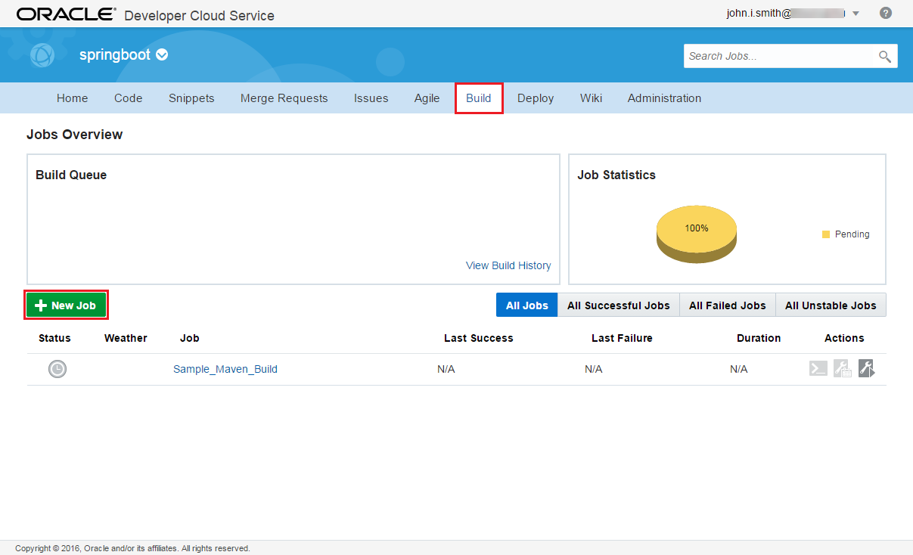

Enter a name for the new job. Select the *Create a free-style job* option and save. On the Main configuration page of the newly created job make sure JDK 8 is the selected JDK.
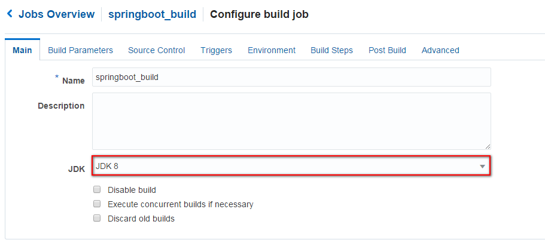

Change to the Source Control tab and select Git. In the git's properties section select the one URL (Initial repository from the imported sources) which is provided in the list. Leave the advanced settings default.
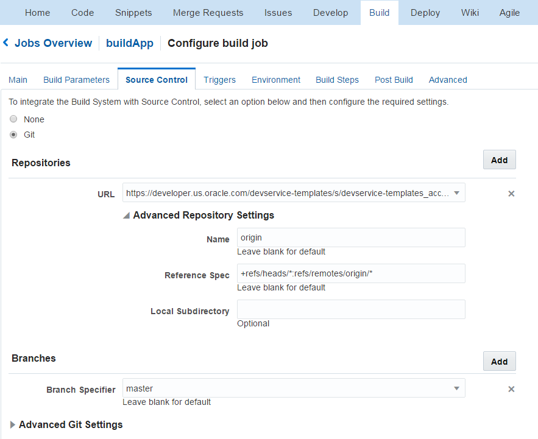

Change to Build Steps tab and add a **Maven 3** build step. Enter **clean install** as Goals and *acc/springboot-sample/pom.xml* to POM File field.
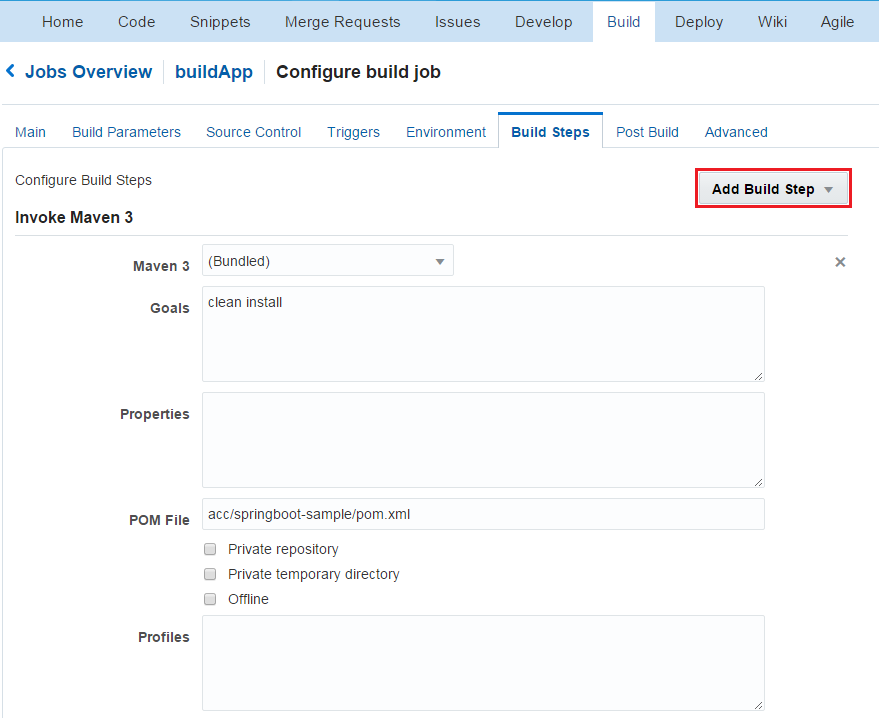

Finally change to Post Build tab and check in the **Archive the artifacts** option. Enter *acc/springboot-sample/target/*.zip* into **Files To Archive** field.

Click on Save to update the new job configurations. To run the build job click Build Now on the job's detail page. Once the job is done check the archived artifacts. It should be the following: springbootdemo-0.0.1.zip
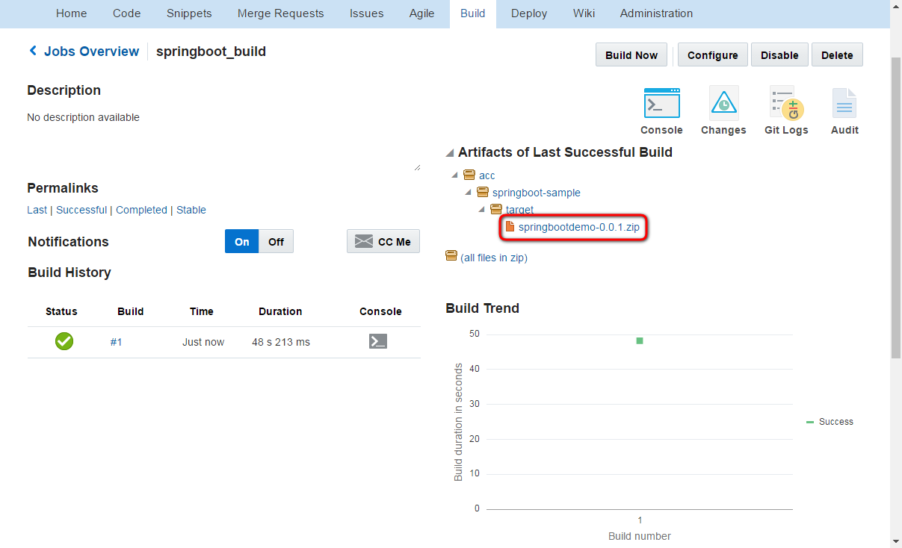

Please note the build job contains an extra build step which packs the default artifact (springbootdemo-0.0.1.jar) and manifest.json (ACCS descriptor from the src/acc.resources folder) into a zip archive. This archive is the desired format to deploy a Java SE application to Oracle Application Container Cloud Service.

#### Configure Oracle Application Container Cloud service deployment ####

Now create deployment configuration which enables direct deployment to Oracle Application Container Cloud service after a successful build job. Change to Deploy page in Oracle Developer Cloud Service's project and create New Configuration.
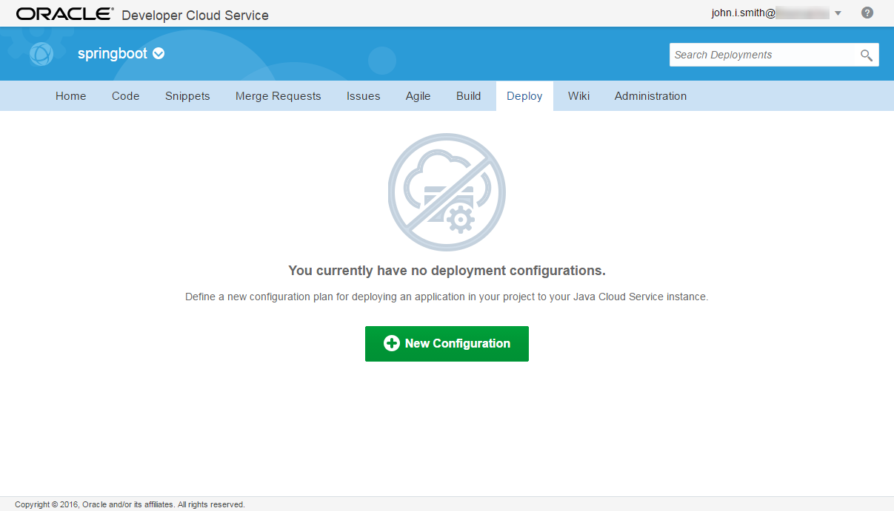

Define the following properties:

+ **Configuration Name**: any name to identify deployment configuration
+ **Application Name**: instance name in Oracle Application Container Cloud Service
+ **Deployment Target**: click on New and select *Application Container Cloud...* and define connection properties such as your Data center, Identity Domain and credentials.
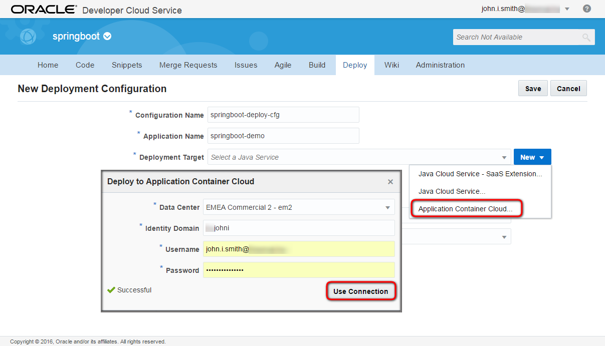

+ **Type**: select *Automatic* which means auto deploy after a successful execution of the build job. Select your previously created job and its artifact to deploy. Click Save.

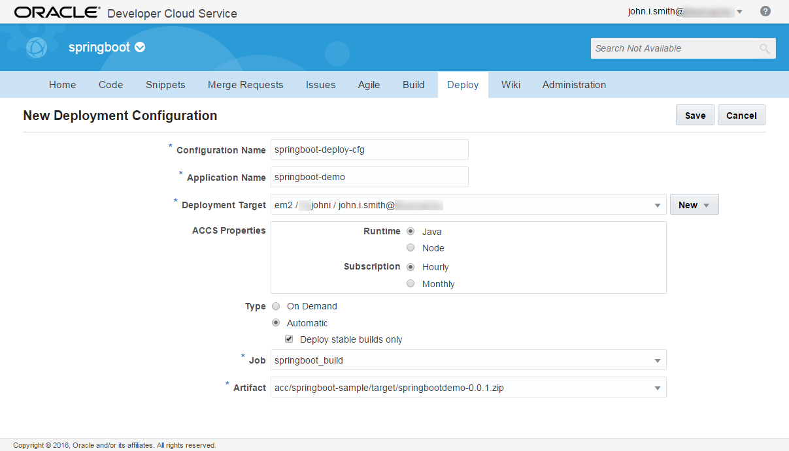

Now trigger the deployment of the application using the gear icon and click Start.
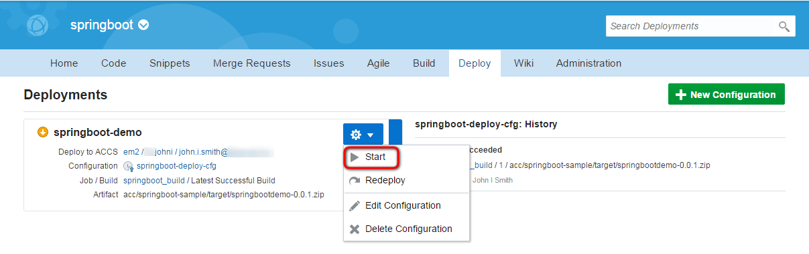

Once the deployment finished successfully you should see similar result. Click the link *Deploy to ACCS* which opens the Application Container Cloud Service Console
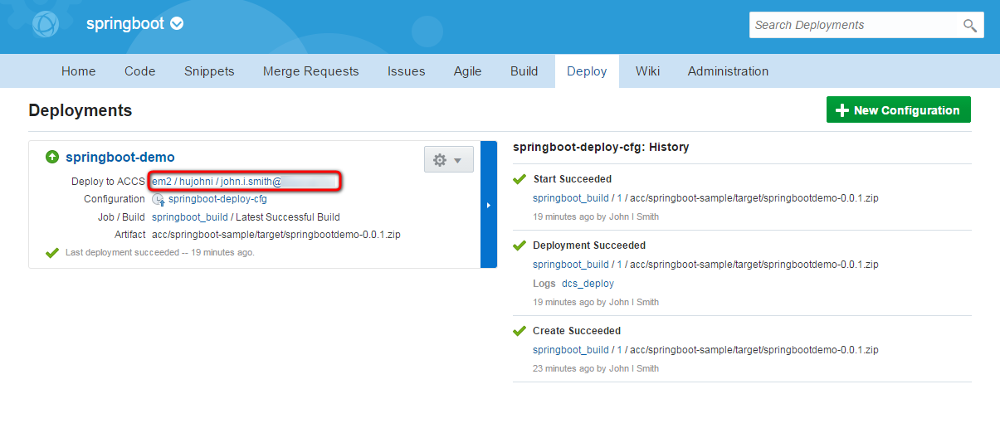

Use the service entry on the console page to access the deployed application. Click the URL.
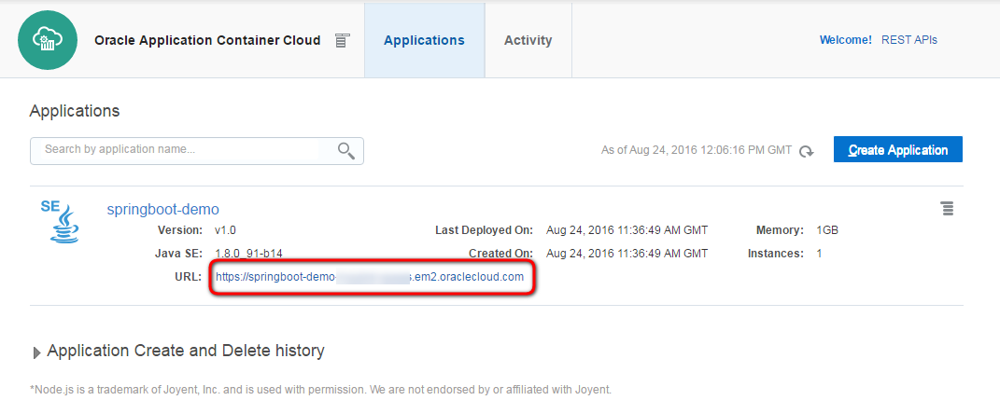

The deployed SpringBoot demo application has one JSP page only.
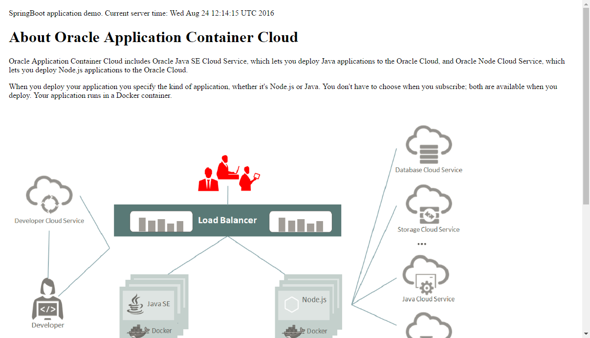